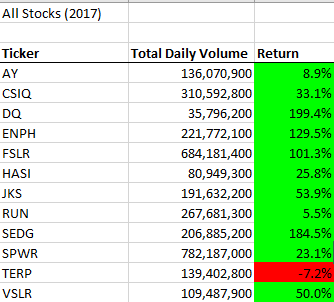
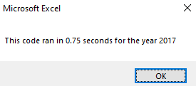

# stocks-analysis
## Overview
- The goal of this project is to use VBA to analyze stock data from 2017 and 2018 in an effort to help a client's parents diversify their portfolio. An existing code was refactored in order to evaluate efficiency between the two.

## Results
- The data for 2017 shows all stocks had a positive return, with the exception of TERP with -7.2%
    - 

- The data for 2018 shows ENPH and RUN outperforming the rest with 81.9% and 84% respectively.
    - 

- The refactored code takes very slightly longer to execute than the original code.
    - 2017 original runtime, pictured below
        - 

    - 2018 original runtime, pictured below
        - 

    - 2017 refactored runtime, pictured below
        - 

    - 2018 refactored runtime, pictured below
        - 

## Summary
- In summary, refactoring code can be used to make the code more efficient. This can be done by taking fewer steps, using less memory, or improving the logic of the code to make it easier for future users to read. 

